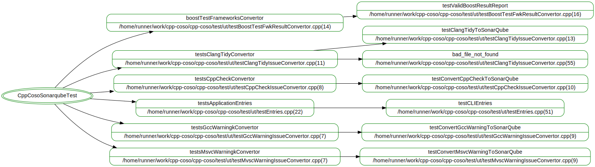

# Stratégie de test

## Tests unitaires

La ligne de commande doit être testé pour vérifier :

- L'affichage du message d'aide
- L'adfichage de la version
- L'affichage du message d'erreur si le rapport demandé est inconnu
- L'affichage du message d'erreur si la source n'est pas trouvé
- L'affichage du message d'erreur si la destination n'est pas trouvé

Pour chaque type de rapport il faut tester : 

- La gestion d'erreur en cas d'appel invalide
- La conversion d'une erreur pour une source donné
- La conversion pour tous les types de sévérité géré par le format
- Le comptage du nombre d'erreur trouver pour une source donée

Tests realisés :

## Tests de fumée

Pour chaque type d'OS testé une collect de rapport et une remonté du rapport dans une analyse sonar

## Tests de compatibilité

Tester la compatibilité du convertisseur avec différente version de :

- BOOST
- clang-tidy
- cppcheck
- gcc : 11 et 12 testé
- mvsc
